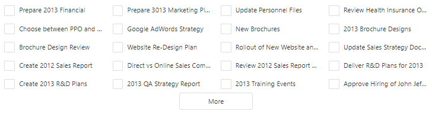

<!-- default badges list -->

[](https://supportcenter.devexpress.com/ticket/details/T479648)
[](https://docs.devexpress.com/GeneralInformation/403183)
[](#does-this-example-address-your-development-requirementsobjectives)
<!-- default badges end -->
# List for DevExtreme - How to create a list with multiple columns

This example demonstrates how you can create List with multiple columns. The main idea is to use CSS and split items into columns:

```css
.dx-list .dx-list-item {
  border: 0;
  width: 25%;
  float: left;
}
```



## Files to Review

- **jQuery**
    - [index.js](jQuery/src/index.js)
    - [index.css](jQuery/src/index.css)
- **Angular**
    - [app.component.html](Angular/src/app/app.component.html)
    - [app.component.scss](Angular/src/app/app.component.scss)
- **Vue**
    - [HomeContent.vue](Vue/src/components/HomeContent.vue)
- **React**
    - [App.tsx](React/src/App.tsx)
    - [App.css](React/src/App.css)
- **ASP.NET Core**
    - [Index.cshtml](ASP.NET%20Core/Views/Home/Index.cshtml)

## Documentation

- [List - API Reference](https://js.devexpress.com/Documentation/ApiReference/UI_Components/dxList/)

The following KB articles will be helpful if you are going to use CSS to change DevExtreme controls' appearance:

- [How to inspect CSS rules](https://www.devexpress.com/Support/Center/Question/Details/K18570/how-to-inspect-css-rules)
- [How to implement CSS-related solutions for DevExpress components](https://supportcenter.devexpress.com/Ticket/Details/T632424/how-to-implement-css-related-solutions-for-devexpress-components)
<!-- feedback -->
## Does This Example Address Your Development Requirements/Objectives?

[](https://www.devexpress.com/support/examples/survey.xml?utm_source=github&utm_campaign=devextreme-list-create-a-list-with-multiple-columns&~~~was_helpful=yes) [](https://www.devexpress.com/support/examples/survey.xml?utm_source=github&utm_campaign=devextreme-list-create-a-list-with-multiple-columns&~~~was_helpful=no)

(you will be redirected to DevExpress.com to submit your response)
<!-- feedback end -->
