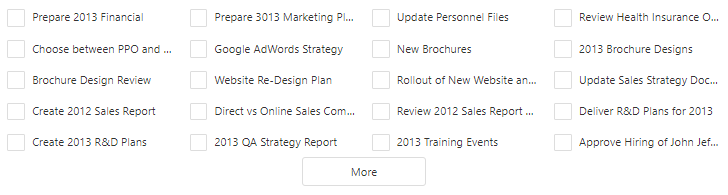

<!-- default badges list -->

[](https://supportcenter.devexpress.com/ticket/details/T479648)
[](https://docs.devexpress.com/GeneralInformation/403183)
<!-- default badges end -->

# List for DevExtreme - How to create a list with multiple columns 

This example demonstrates how you can create List with multiple columns. The main idea is to use CSS and split items into columns:
```css
.dx-list .dx-list-item {
    border: 0px;
    width: 25%;
    float: left;
}
```


<div align="center"></div>

## Files to Review

- **JS**
    - [index.html](JS/index.html)

## Documentation

The following KB articles will be helpful if you are going to use CSS to change DevExtreme controls' appearance:
<br/>
- <a href="https://www.devexpress.com/Support/Center/Question/Details/K18570/how-to-inspect-css-rules">How to inspect CSS rules</a>
- <a href="https://supportcenter.devexpress.com/Ticket/Details/T632424/how-to-implement-css-related-solutions-for-devexpress-components">How to implement CSS-related solutions for DevExpress components</a>
